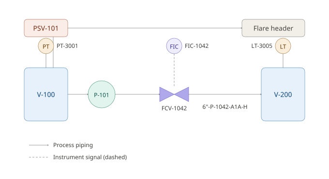
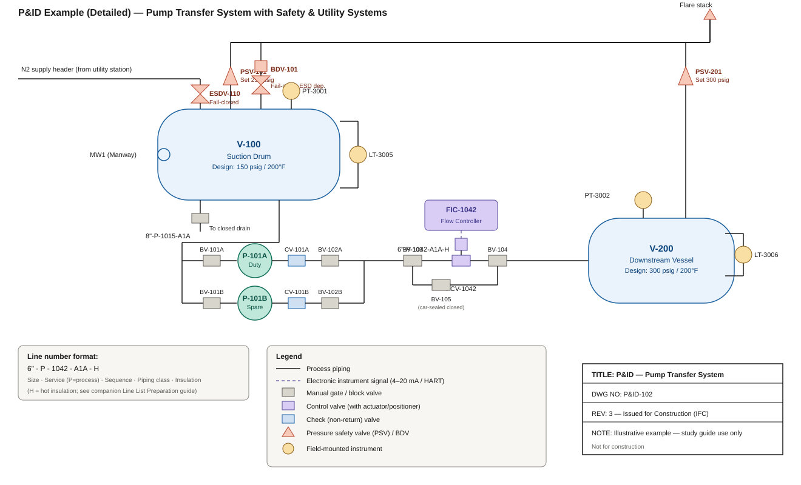

# 📐 P&ID / PEFS Development — Practical Study Guide

> A field-oriented reference covering the core engineering topics in Process Engineering Flow Scheme (PEFS) and Piping & Instrumentation Diagram (P&ID) development — combining ISA/ISO standard methodology with worked sample calculations, sample documents, and design-basis assumptions drawn from real project execution. This guide is a companion to the **Flare Network Design**, **Depressurization Calculation**, **Compressor Settle-Out Calculations**, **Line List Preparation**, **Instrumentation Process Datasheet Preparation**, and **Mechanical Datasheet Preparation** study guides — the P&ID is the single drawing where every one of those disciplines' outputs (line numbers, instrument tags, PSV/BDV sizing, equipment nozzles) must appear consistently together.

**Illustrative project used throughout this guide:** the same suction vessel (V-100), pump (P-101), and downstream vessel (V-200) used throughout this guide series, developed from an early PEFS through to an issued-for-construction P&ID — used to work through mass balance closure checking, a line-size cross-check catch, nitrogen blanketing utility sizing, and instrument air header sizing. All numbers below are worked sample calculations for study purposes — always replace with project-specific process data.

---

## 📑 Table of Contents

1. [Design Basis & Assumptions](#1-design-basis--assumptions)
2. [Purpose & Differences — PEFS vs. P&ID](#2-purpose--differences--pefs-vs-pid)
3. [Standards & Symbols](#3-standards--symbols)
4. [Key Elements in PEFS](#4-key-elements-in-pefs)
5. [Key Elements in P&ID](#5-key-elements-in-pid)
6. [Development Workflow](#6-development-workflow)
7. [Integration with Other Deliverables](#7-integration-with-other-deliverables)
8. [Sample Calculation Sheets](#8-sample-calculation-sheets)
9. [Sample Documents & Legends](#9-sample-documents--legends)
10. [Practical Design Checklist](#10-practical-design-checklist)
11. [Common Field Issues & Lessons Learned](#11-common-field-issues--lessons-learned)
12. [Case Study — ESD Valve Omitted During PEFS-to-P&ID Translation](#12-case-study--esd-valve-omitted-during-pefs-to-pid-translation)
13. [Reference Standards](#13-reference-standards)

---

## 1. Design Basis & Assumptions

PEFS and P&ID development is governed by a **"P&ID Legend / Basis of Design"** document (symbols, line numbering convention, tag numbering convention) issued and frozen early — every subsequent revision of the flow schemes and diagrams must follow it consistently, since the P&ID is the drawing every other discipline (piping, instrumentation, mechanical, safety) cross-references directly.

### 1.1 Project & Process Basis (illustrative project)
| Parameter | Value | Notes |
|---|---|---|
| Unit | Pump transfer system, V-100 → P-101 → V-200 | Same system used throughout this guide series |
| Feed stream (to splitter node, PEFS stage) | 500 kg/hr | Used in Calc Sheet 8.1 mass balance check |
| Pump P-101 rated flow | 150 gpm (design), up to 500 gpm (alternate high-flow case) | Used in Calc Sheet 8.2 line-size cross-check |
| Line 6"-P-1042-A1A-H | Pump discharge, per companion Line List guide | Design pressure 310 psig |
| Storage tank T-201 (illustrative, PEFS utility example) | Atmospheric, N₂ blanketed, max pump-out rate 300 gpm | Used in Calc Sheet 8.3 |
| Instrument air consumers on this unit | 15 control valve positioners + 2 large ESD valve actuators | Used in Calc Sheet 8.4 |
| P&ID legend/symbol standard | ISA S5.1, project-specific legend sheet | — |

### 1.2 Codes & Standards / Methodology Basis
- **ISA-5.1** — Instrumentation Symbols and Identification
- **ISO 10628** — Diagrams for the chemical and petrochemical industry (flow diagrams, PEFS/PFD-equivalent conventions)
- Project/company **P&ID legend sheet** — line numbering, tag conventions, symbol library; governs where it is more specific than the generic ISA/ISO standards
- Companion guides in this series — provide the sizing/design-basis inputs (line list design pressures, PSV orifice sizing, instrument ranges, equipment nozzle schedules) that populate the P&ID's data fields

### 1.3 Key Design Assumptions (typical, to be confirmed per project)
| Assumption | Typical Value | Basis / Justification |
|---|---|---|
| Mass balance closure tolerance (PEFS stage) | ±0.5–1% of feed, hand/simulation balance | Tighter for simulation-based balances; confirm project's actual tolerance policy |
| Line velocity guideline (general liquid service) | 1–3 m/s typical, up to ~4.5 m/s for short runs | Confirm against project piping design philosophy; erosion/AIV limits (companion Flare Network and Flow Assurance guides) can further restrict this |
| N₂ blanketing/purge basis | Sized to match maximum liquid pump-out (in-breathing) rate, plus margin | API 2000 provides the full thermal + pump-out breathing methodology; this guide uses the simplified pump-out-rate basis common for first-pass sizing |
| Instrument air header design margin | +25% over calculated peak demand | Confirm project instrument air philosophy; some projects size on N-1 compressor redundancy rather than a flat percentage margin |
| P&ID revision stages | IFD (Issued for Design) → IFR (Issued for Review/HAZOP) → IFC (Issued for Construction) → As-Built | Confirm actual project stage-gate naming and required sign-offs at each stage |

> ⚠️ **Practical note:** The P&ID legend sheet (line numbering, tag conventions, symbol library) should be treated with the same rigor as the piping material specification in the companion Line List guide — issuing P&IDs before the legend is frozen leads to inconsistent numbering that is expensive to retrofit once dozens of drawings are in circulation.

---

## 2. Purpose & Differences — PEFS vs. P&ID

### 2.1 PEFS (Process Engineering Flow Scheme)
- A **high-level schematic** showing process flow, major equipment, and streams — the process "story" of the unit, without the full construction-level detail.
- Used in **early design** (conceptual, FEED) to establish and communicate the process concept, get stakeholder/client alignment, and provide the basis for early equipment sizing and the heat & mass balance.
- Sometimes called a PFD (Process Flow Diagram) in other regional/company naming conventions — the underlying purpose is the same.

### 2.2 P&ID (Piping & Instrumentation Diagram)
- A **detailed diagram** showing every piece of equipment, all piping (with line numbers and specs), valves, instruments, and control loops — the construction- and operations-level document.
- Used for **detailed design, construction, commissioning, and ongoing operations** — the P&ID is a living document maintained through the plant's operating life (as-built and subsequently updated through MOC), not a one-time deliverable.

### 2.3 Practical Distinction
| | PEFS | P&ID |
|---|---|---|
| Detail level | Major equipment and streams only | Every valve, instrument, line, and safety device |
| Stage used | Conceptual / FEED | Detailed design → construction → operations |
| Typical content | Equipment symbols, stream arrows, basic operating conditions | Full piping/instrumentation symbology per ISA-5.1, line numbers, tag numbers |
| Audience | Process engineers, client/stakeholder review | All disciplines, construction, operations, HAZOP team |
| Lifespan | Effectively frozen once P&IDs supersede it | Living document, revised through plant life via MOC |

---

## 3. Standards & Symbols

### 3.1 ISA-5.1 — Instrumentation Symbols and Identification
Defines the standard symbol library and tag-lettering convention (e.g., "PT" = pressure transmitter, "FIC" = flow indicating controller) used on P&IDs — this is the same tag convention that must align with the instrument index and the process datasheets from the companion Instrumentation guide.

### 3.2 ISO 10628 — Flow Diagrams for Process Plants
Provides international standard conventions for flow diagram symbology, applicable to both PEFS/PFD-level and P&ID-level diagrams — used where a project's contractual basis specifies ISO conventions in lieu of, or alongside, company-specific standards.

### 3.3 Company/Project-Specific Standards
- **Line numbering convention** — must match the companion Line List Preparation guide's numbering philosophy (Section 3 of that guide) exactly; the P&ID and line list are two views of the same underlying data and must never diverge.
- **Tag conventions** — instrument and valve tag numbering must match the companion Instrumentation guide's conventions and the instrument index.
- **Legend sheets** — the first sheet(s) of any P&ID package, defining every symbol, line type, and abbreviation used throughout the set; should be issued and frozen before detailed P&ID drafting begins (Section 1.3 practical note).

---

## 4. Key Elements in PEFS

### 4.1 Major Equipment
Columns, reactors, exchangers, pumps, compressors — shown as simplified symbols with equipment tag numbers, sized/selected at a preliminary level sufficient for the heat & mass balance and early layout.

### 4.2 Process Streams
Shown with **flow direction, phase (vapor/liquid/two-phase), and composition** — each stream typically numbered and cross-referenced to a stream summary table (heat & mass balance extract) that accompanies the PEFS, showing flow rate, temperature, pressure, and composition for each numbered stream (see Section 9.1 for a sample).

### 4.3 Basic Operating Conditions
Pressure, temperature, and flow shown at key points — enough detail to support early equipment sizing and utility/duty estimates, but not the full design-condition detail that the P&ID and downstream datasheets will carry.

### 4.4 Utility Connections
Steam, cooling water, nitrogen, instrument air, and similar utility tie-ins are shown at a conceptual level on the PEFS — establishing that a utility connection exists and its approximate duty/flow, ahead of the detailed sizing that will follow (see Calc Sheets 8.3–8.4 for worked utility sizing examples).

---

## 5. Key Elements in P&ID

### 5.1 Piping
Line numbers, sizes, specs (piping class), insulation, and tracing — every field here must match the companion Line List Preparation guide's line list entry exactly; the P&ID is effectively the graphical representation of the line list.

### 5.2 Valves
Isolation, control, check, and relief valves, each with a unique tag number — control valve tags/sizing must match the companion Instrumentation guide's control valve datasheet; PSV/BDV tags and sizing must match the companion Flare Network Design and Depressurization Calculation guides' PSV/BDV datasheets.

### 5.3 Instrumentation
Transmitters, controllers, indicators, and interlocks, shown with ISA-5.1 symbology and tag numbers that must align exactly with the instrument index and the companion Instrumentation Process Datasheet guide.

### 5.4 Safety Systems
PSVs, BDVs, ESD valves, and flare connections — these are the graphical representation of the companion Flare Network Design and Depressurization Calculation guides' relief/blowdown studies, and must be shown with correct routing, isolation philosophy, and tie-in points (the same trapped-volume boundary logic from the companion Compressor Settle-Out guide depends on the P&ID accurately showing which valves isolate which volumes).

### 5.5 Control Loops
Signal lines and DCS/PLC interfaces, distinguishing pneumatic, electronic (4–20 mA/HART), and fieldbus signal types per the companion Instrumentation guide's signal-type conventions (Section 7.2 of that guide).

### 5.6 Notes & Legends
Special requirements — sour service flags, piggable line notes, PWHT requirements — cross-referenced to the companion Line List and Flow Assurance guides' service/material basis, so a reviewer doesn't need to consult a separate document to know a line is sour-service-rated.

---

## 6. Development Workflow

### 6.1 Step 1 — Start with the PEFS
Define the process flow and major equipment; establish the heat & mass balance that will size everything downstream.

### 6.2 Step 2 — Translate to P&ID
Add piping (line numbers/specs), valves, instruments, and safety systems — this translation step is where the PEFS's conceptual-level information becomes construction-level detail, and it is also where translation errors most commonly occur (see the Case Study, Section 12) since it requires adding a large volume of new detail while preserving the original process intent.

### 6.3 Step 3 — Cross-Check with Line List & Equipment Datasheets
Every line number, size, and spec shown on the P&ID must reconcile exactly with the line list (companion guide); every equipment nozzle shown must reconcile with the mechanical datasheet's nozzle schedule (companion guide) — see Calc Sheet 8.2 for an example of exactly this kind of cross-check catching a real discrepancy.

### 6.4 Step 4 — Multidisciplinary Review
Process, piping, mechanical, instrumentation, and safety disciplines each review the P&ID from their own perspective — this is also typically where the formal **HAZOP** is conducted, using the P&ID as the primary reference document; HAZOP findings frequently drive P&ID revisions (additional isolation valves, interlocks, or relief paths).

### 6.5 Step 5 — Issue Revisions
P&IDs progress through formal revision stages — commonly **IFD (Issued for Design)** → **IFR (Issued for Review/HAZOP)** → **IFC (Issued for Construction)** → **As-Built** — with each stage requiring defined sign-offs and a controlled revision record, consistent with the document control discipline emphasized throughout this guide series.

---

## 7. Integration with Other Deliverables

### 7.1 Line List
Ensures consistency in line numbers and specs — the line list (companion guide) and the P&ID must always match; any discrepancy is a red flag requiring investigation before either document is issued for construction.

### 7.2 Equipment Datasheets
Nozzle sizes and operating conditions shown on the P&ID must match the mechanical datasheet's nozzle schedule (companion guide) and the process datasheet's operating conditions exactly.

### 7.3 Instrument Index
Tags and ranges shown on the P&ID must align with the instrument index and the companion Instrumentation Process Datasheet guide — a tag shown on the P&ID that doesn't exist in the instrument index (or vice versa) is a common and easily-caught cross-check finding.

### 7.4 Cause & Effect Diagrams
The P&ID's safety systems (Section 5.4) are the physical implementation of the cause & effect (C&E) matrix's logic — every action listed in the C&E matrix (e.g., "close ESDV-101 on high-high pressure") must correspond to an actual valve shown on the P&ID with a matching tag, and every safety-critical valve on the P&ID should trace back to a C&E matrix entry justifying its presence and its trip logic. See Section 9.5 for a sample C&E excerpt, and the Case Study (Section 12) for what happens when this cross-reference breaks down.

---

## 8. Sample Calculation Sheets

> All calculations below use the illustrative project basis in Section 1. Values are for study purposes — verify against project-specific process data.

### 8.1 Calc Sheet 1 — PEFS Mass Balance Closure Check

**Given:**
- Feed stream to a splitter node = 500 kg/hr
- Outlet Stream A = 310 kg/hr
- Outlet Stream B = 170 kg/hr

**Step 1 — Sum the outlet streams:**
```
Σ Outlets = 310 + 170 = 480 kg/hr
```

**Step 2 — Compare to the feed (mass balance closure check):**
```
Imbalance = Feed − Σ Outlets = 500 − 480 = 20 kg/hr
Imbalance (%) = 20 / 500 × 100 = 4.0%
```

**Step 3 — Compare against the project's closure tolerance (Section 1.3, ±0.5–1%):**
```
4.0% ≫ 1% tolerance  →  FAIL — investigate before issuing the PEFS
```

**Investigation finding (illustrative):** A 20 kg/hr vent/purge stream from the splitter's downstream vessel had been omitted from the stream summary table — once added, the balance closes: `310 + 170 + 20 = 500 kg/hr` (0% imbalance).

**Result:** The mass balance closure check **caught a missing stream** before the PEFS was issued — this is exactly the kind of check that should be performed on every material balance node before a PEFS is released for review, not just trusted because the simulation "ran successfully."

> 📌 **Assumption check:** A closure check that passes only confirms mass conservation arithmetic — it does not confirm the *composition* balance closes stream-by-stream, which requires a separate (and equally important) component-by-component check, particularly for multi-phase or reactive systems.

---

### 8.2 Calc Sheet 2 — Line Size Cross-Check (P&ID vs. Line List)

**Given:**
- Alternate high-flow case, Q = 500 gpm = 0.0315 m³/s
- P&ID drawing shows the pump discharge line annotated as 3-inch (a drafting note, to be verified)
- Line list (companion guide) specifies this line as 6-inch (6"-P-1042-A1A-H)

**Step 1 — Velocity check at the P&ID-drawn 3-inch size:**
```
3-in Sch 40 ID = 3.068 in = 0.0779 m
Area = (π/4) × (0.0779)² ≈ 0.00477 m²
V = Q / A = 0.0315 / 0.00477 ≈ 6.6 m/s
```
Compare to the general liquid velocity guideline (1–3 m/s typical, up to ~4.5 m/s for short runs, Section 1.3): **6.6 m/s exceeds the guideline — FAIL.**

**Step 2 — Velocity check at the line-list-specified 6-inch size:**
```
6-in Sch 40 ID = 6.065 in = 0.1541 m
Area = (π/4) × (0.1541)² ≈ 0.01865 m²
V = Q / A = 0.0315 / 0.01865 ≈ 1.69 m/s
```
Compare to guideline: **1.69 m/s — PASS, within the typical 1–3 m/s range.**

**Result:** The P&ID's "3-inch" annotation was a **drafting error** — the line list's 6-inch specification is correct and matches an acceptable velocity, while the P&ID's drawn size would produce an unacceptably high velocity (erosion/noise/water-hammer risk). This is precisely the kind of discrepancy the Step 3 cross-check (Section 6.3) is designed to catch before construction.

> 📌 **Assumption check:** This example checks general liquid velocity guidelines only — for services with sand/erosion potential, also run the API RP 14E erosional velocity check (companion Flow Assurance guide, Calc Sheet 8.4 methodology) as part of the same cross-check, since a line can pass a general velocity guideline while still failing an erosion-specific check for a particular service.

---

### 8.3 Calc Sheet 3 — Nitrogen Blanketing Flow (PEFS Utility Connection)

**Given:**
- Storage tank T-201, atmospheric, N₂ blanketed
- Maximum liquid pump-out rate = 300 gpm
- Design margin = 10% (Section 1.3 basis, simplified first-pass approach)

**Step 1 — Convert maximum pump-out rate to volumetric vapor displacement rate:**
```
300 gpm × 0.1337 ft³/gal = 40.1 ft³/min (scfm), since the vapor space must be replaced 1:1 (by volume) as liquid leaves, to prevent a vacuum condition
```

**Step 2 — Apply design margin:**
```
N₂ supply requirement = 40.1 × 1.10 ≈ 44.1 scfm
```

**Result:** The nitrogen blanketing supply/regulator and header shown on the PEFS utility connection must be sized for **≥44 scfm**. This figure becomes the basis for the utility header sizing shown on the P&ID and the blanketing valve's own instrument datasheet (companion Instrumentation guide).

> 📌 **Assumption check:** This simplified calc uses only the pump-out (in-breathing) case, which is usually the governing case for blanketing supply sizing — a full **API 2000** analysis also evaluates thermal in-breathing (vapor contraction from a temperature drop, e.g., a sudden rainstorm) and thermal/pump-in out-breathing (for the vent/relief side of the same tank), and should be performed for the final utility and tank venting design, not just this first-pass check.

---

### 8.4 Calc Sheet 4 — Instrument Air Header Sizing (Sum of Consumers)

**Given:**
- 15 control valve positioners, each with continuous bleed consumption ≈ 0.8 scfm (smart positioner, typical)
- 2 large ESD valve actuators, each with peak stroke demand ≈ 15 scfm (short duration, but potentially simultaneous during an ESD event)
- Design margin = 25% (Section 1.3 basis)

**Step 1 — Continuous consumption (control valve positioners):**
```
15 × 0.8 = 12.0 scfm
```

**Step 2 — Peak simultaneous stroke demand (ESD valves, worst case both stroke together):**
```
2 × 15 = 30.0 scfm
```

**Step 3 — Total peak instantaneous demand:**
```
Total peak = Continuous + Peak stroke = 12.0 + 30.0 = 42.0 scfm
```

**Step 4 — Apply design margin:**
```
Header/compressor design capacity = 42.0 × 1.25 = 52.5 scfm
```

**Result:** The instrument air header (and upstream compressor/receiver sizing, coordinated with the utility/mechanical discipline) shown tying into this unit's P&ID should be sized for **≥52.5 scfm**.

> 📌 **Assumption check:** This example assumes the two ESD valves stroke simultaneously (a conservative worst case) — confirm the actual ESD logic (companion Cause & Effect discussion, Section 7.4) to determine whether simultaneous stroke is actually credible for the specific valves in question, since assuming every valve strokes at once for every header on a large plant can significantly over-size utility infrastructure; a scenario-based (cause-and-effect-driven) approach is more accurate for large systems with many valves.

---

## 9. Sample Documents & Legends

### 9.1 Sample PEFS Stream Summary Table

| Stream No. | Description | Phase | Flow (kg/hr) | Pressure (barg) | Temperature (°C) |
|---|---|---|---|---|---|
| 1 | Feed to splitter | Liquid | 500 | 10.3 | 37.8 |
| 2 | Splitter outlet A (to V-100) | Liquid | 310 | 10.3 | 37.8 |
| 3 | Splitter outlet B (to storage) | Liquid | 170 | 10.3 | 37.8 |
| 4 | Vessel vent (to flare header) | Vapor | 20 | 10.3 | 37.8 |
| 5 | Pump P-101 discharge (to V-200) | Liquid | 310 | 21.4 | 40.6 |

*(Illustrative — includes the Calc Sheet 8.1 vent stream once correctly added, closing the mass balance.)*

---

### 9.2 Sample P&ID Legend Excerpt (ISA-5.1 Based)

| Symbol/Tag Prefix | Meaning | Example |
|---|---|---|
| PT | Pressure Transmitter | PT-3001 |
| LT | Level Transmitter | LT-3005 |
| FT / FE | Flow Transmitter / Flow Element | FT-2031 / FE-2031 |
| FCV | Flow Control Valve | FCV-1042 |
| PSV | Pressure Safety Valve | PSV-101 |
| BDV | Blowdown Valve | BDV-101 |
| ESDV | Emergency Shutdown Valve | ESDV-105 |
| — · — · — | Instrument signal line (electronic) | — |
| —— | Process piping | — |
| ⊘ | Isolation (block) valve | — |

*(Illustrative excerpt — a real legend sheet defines every symbol, line type, and abbreviation used on the P&ID set in full, per ISA-5.1 and the project-specific legend.)*

---

### 9.3 Sample P&ID Line/Valve Cross-Reference (Post Calc Sheet 8.2 Correction)

| Line No. | P&ID Sheet | Size (Corrected) | Line List Reference | Status |
|---|---|---|---|---|
| 6"-P-1042-A1A-H | P&ID-102, Rev 3 | 6-in (corrected from erroneous 3-in annotation) | Line List Rev 4 | Reconciled — IFC |

---

### 9.4 Example P&ID Diagrams

**Basic example** — the same illustrative V-100 → P-101 → V-200 system used throughout this guide, drawn as a simplified P&ID:



Reading this diagram: the **blue boxes** are the vessels (V-100, V-200); the **amber circles** are field instruments (PT-3001, LT-3005) using the ISA-5.1 bubble symbol; the **coral box** is PSV-101 relieving to the flare header — the graphical representation of a relief study like the one in the companion Flare Network Design guide; the **teal circle** is pump P-101; the **purple items** are the control loop — FCV-1042 (the valve, in the pipe) and FIC-1042 (the controller, shown above it) linked by a **dashed line**, which is the standard P&ID convention for an instrument signal, as distinct from the **solid line** used for process piping (see the legend at the bottom of the drawing). The line number `6"-P-1042-A1A-H` on the discharge line is the same entry that would appear in the companion Line List Preparation guide.

**Detailed example** — the same system expanded with elements a real P&ID would include that the basic version leaves out, to illustrate more of this guide's Section 5 concepts at once:



What this version adds, and the concept each one illustrates:

| Added element | Concept it illustrates |
|---|---|
| N₂ supply header + **ESDV-110** into V-100 | A utility connection (Section 4.4/8.3) with its own automatic isolation valve — the exact type of safety-critical utility tie-in discussed in this guide's Case Study (Section 12) |
| **PSV-101** and **BDV-101** both routed to a common flare header | Two different safety systems (relief vs. active depressurization) sharing one flare tie-in — consistent with the companion Flare Network Design and Depressurization Calculation guides |
| **MW1** (manway) and a **drain** with its own valve | Mechanical/maintenance-access nozzles that still need a tag and a line, even though they're not part of normal process flow — cross-referenced to the companion Mechanical Datasheet guide's nozzle schedule |
| **LT-3005** as two taps + an external bridle pipe | How a differential-pressure level transmitter is actually piped on a vessel, rather than a single bubble symbol |
| **P-101A (duty) / P-101B (spare)** with individual block valves and check valves | A standard duty/spare rotating equipment arrangement — each pump independently isolable, with a check valve preventing backflow through the idle spare |
| **BV-103 / FCV-1042 / BV-104 with a bypass (BV-105)** | A classic three-valve control station: block valves on either side of the control valve so it can be isolated and maintained, plus a bypass path (normally car-sealed closed) so the process can still be run manually if the control valve is out of service |
| **PSV-201** on V-200 | Every pressure vessel needs its own overpressure protection — not just the upstream one |
| Line number format callout | A worked breakdown of the `6"-P-1042-A1A-H` line number string, tying directly to the companion Line List Preparation guide's numbering convention (Section 3 of that guide) |
| Title block | The standard drafting information (drawing number, revision, status) every real P&ID carries, tracked through the IFD → IFR → IFC → As-Built stages (Section 6.5) |

> 📌 **Note:** Both diagrams are illustrative teaching examples for this guide, not certified engineering drawings — always develop actual project P&IDs against the project's own legend, numbering philosophy, and HAZOP-reviewed design.

---

### 9.5 Sample Cause & Effect Matrix Excerpt

| Cause | PT-3001 High-High | LT-3005 High-High | Manual ESD Pushbutton |
|---|---|---|---|
| **Close FCV-1042** | X | — | X |
| **Open BDV-101** | X | — | X |
| **Close ESDV-105 (V-100 inlet)** | X | X | X |
| **Alarm to DCS** | X | X | X |

*(Illustrative excerpt — every "X" in a real C&E matrix must correspond to an actual, correctly-tagged valve shown on the P&ID, per Section 7.4.)*

---

## 10. Practical Design Checklist

- [ ] P&ID legend sheet (symbols, line numbering, tag conventions) issued and frozen before detailed P&ID drafting begins
- [ ] PEFS mass balance closure checked at every major node before issue — see Calc Sheet 8.1
- [ ] Every line number, size, and spec on the P&ID cross-checked against the line list — see Calc Sheet 8.2
- [ ] Every equipment nozzle shown on the P&ID cross-checked against the mechanical datasheet's nozzle schedule
- [ ] Every instrument tag on the P&ID cross-checked against the instrument index
- [ ] Utility connections (N₂, instrument air, steam, cooling water) sized and shown consistently between PEFS and P&ID — see Calc Sheets 8.3–8.4
- [ ] Every safety-critical valve (PSV, BDV, ESDV) on the P&ID traceable to a cause & effect matrix entry, and vice versa — see Section 9.5
- [ ] Sour service, piggable line, and other special-requirement notes cross-referenced to the line list/Flow Assurance basis, not stated independently
- [ ] Multidisciplinary review (process, piping, mechanical, instrumentation, safety) completed and comments closed out before HAZOP
- [ ] HAZOP conducted against the P&ID, and all resulting action items tracked to closure with a documented P&ID revision where applicable
- [ ] Revision stage (IFD/IFR/IFC/As-Built) clearly marked and controlled, with defined sign-offs at each stage
- [ ] As-built P&ID update process defined for post-startup MOC changes, so the P&ID remains a living, accurate document

---

## 11. Common Field Issues & Lessons Learned

| Issue | Root Cause | Practical Fix |
|---|---|---|
| Line size discrepancy between P&ID and line list found during construction | P&ID drafted with a preliminary size that was never updated after the line list was finalized | Perform the Section 6.3 cross-check (Calc Sheet 8.2 example) as a mandatory step before each P&ID revision is issued, not just at IFC |
| PEFS mass balance found not to close during a later detailed simulation | Balance closure never explicitly checked at each node before the PEFS was issued for review | Make node-by-node closure checking (Calc Sheet 8.1) a standard step before PEFS issue, not assumed from "the simulation converged" |
| Safety valve shown on P&ID with no corresponding cause & effect logic | P&ID and C&E matrix developed somewhat independently, without a formal cross-reference step | Require every safety-critical valve to be traceable to a C&E entry and vice versa, as a specific HAZOP/review checklist item — see Case Study, Section 12 |
| Utility header undersized shortly after startup | Utility sizing done at PEFS stage using a rough estimate, never revisited once actual instrument/valve count was finalized on the P&ID | Recalculate utility consumption (Calc Sheet 8.4 method) once the P&ID's actual consumer count is known, not left at the PEFS-stage estimate |
| Instrument tag on P&ID with no matching instrument index entry (or vice versa) | Tag added directly on a P&ID markup without a corresponding instrument index update | Enforce a synchronized update process — any tag added/changed on the P&ID must simultaneously update the instrument index, not as a later reconciliation exercise |

---

## 12. Case Study — ESD Valve Omitted During PEFS-to-P&ID Translation

> A composite, illustrative case study based on the type of finding commonly encountered during HAZOP review of newly developed P&IDs. Names, tag numbers, and figures are representative, not project-specific.

### 12.1 Background

During conceptual design, the PEFS for the V-100/P-101/V-200 transfer system (this guide's illustrative project) showed a simple utility nitrogen blanketing connection to V-100's vapor space, consistent with Calc Sheet 8.3 of this guide — a single line, shown conceptually, with no isolation valve detail at the PEFS level (appropriate for that stage, per Section 4.4).

When the design team translated the PEFS into the detailed P&ID (Section 6.2), the nitrogen blanketing connection was drawn with a manual isolation valve for maintenance purposes, but the **automatic ESD valve** that the project's standard P&ID legend/philosophy required on all utility connections to vessels handling hazardous inventory (to prevent a hydrocarbon backflow path into the nitrogen header during an upset) was **not added** — the draftsperson carried over the PEFS's simple single-line representation rather than applying the full P&ID-level safety system convention.

### 12.2 Problem Identified

During the formal HAZOP review of the P&ID (Section 6.4), the safety engineering team's node-by-node review of the nitrogen blanketing connection identified the missing ESD valve as a **gap against the company's standard P&ID philosophy** — the guide word "reverse flow" applied to the N₂ connection node prompted the question of what would prevent hydrocarbon vapor from migrating into the nitrogen header if V-100's pressure exceeded the nitrogen supply pressure during an upset, and the team found no automatic isolation was shown, only the manual valve.

### 12.3 Investigation & Cross-Check

Reviewing the project's P&ID philosophy/legend document (Section 1.3, Section 3.3 of this guide) confirmed the automatic ESD valve was indeed a standing requirement for this type of connection — the omission was not a deliberate design decision but a translation gap between the PEFS's appropriately simple conceptual representation and the P&ID's required level of safety-system detail.

Cross-checking the cause & effect matrix (Section 7.4, Section 9.5 of this guide) confirmed no corresponding C&E logic existed for this valve either, since the valve itself had never been added to the P&ID — reinforcing that the P&ID-to-C&E cross-reference check (a standard step per this guide's Practical Design Checklist) had not yet been performed at the point the drawing was issued for HAZOP, which is in fact one of the reasons the HAZOP step exists.

### 12.4 Root Cause

Two compounding root causes were identified:
1. **PEFS-to-P&ID translation gap** — the drafting team carried over the PEFS's simplified representation of the utility connection without independently applying the P&ID-level safety system standard for that connection type, treating the translation as primarily a "add piping detail" exercise rather than also a "apply the full safety system philosophy" exercise.
2. **No pre-HAZOP self-check against the P&ID philosophy document** — a systematic check of every utility/hazardous-service tie-in against the project's standard safety system requirements (before the drawing reached the formal HAZOP) could have caught this earlier and cheaper, rather than relying on the HAZOP team to catch it as, in effect, the first line of defense.

### 12.5 Resolution

- The P&ID was revised to add the required automatic ESD valve (tagged ESDV-110) on the nitrogen blanketing connection, along with the corresponding cause & effect logic (closing ESDV-110 on high V-100 pressure or loss of nitrogen supply pressure, consistent with the reverse-flow prevention intent).
- Because the finding was caught during HAZOP — **before** IFC issue — no construction rework was required, only a drawing revision and an update to the instrument/valve index and the C&E matrix.
- The project's P&ID development procedure was updated to add an explicit **pre-HAZOP self-check step**: every utility connection to a hazardous-service vessel must be checked against the standard P&ID philosophy's safety system requirements by the originating discipline, before the drawing is issued for formal HAZOP — narrowing the HAZOP's role back to catching genuinely scenario-specific gaps, rather than standard-compliance gaps that should have been caught earlier.

### 12.6 Outcome

- The gap was caught at a normal, expected point in the development workflow (HAZOP) rather than later, and the cost of the fix was limited to a drawing and document revision — but the finding was still logged as a process improvement opportunity, since an earlier self-check could have avoided consuming HAZOP team time on a standards-compliance issue rather than a genuinely novel scenario.
- The finding was documented as a lessons-learned item: **PEFS-to-P&ID translation is not just an "add detail" exercise** — it requires deliberately re-applying the full P&ID-level design philosophy (safety systems, isolation requirements) to every element carried over from the simpler PEFS representation, not just adding piping and instrument symbols around the existing conceptual layout.

### 12.7 Case-Specific Lessons Learned

| Lesson | Applied Fix |
|---|---|
| Translating a PEFS connection into a P&ID is not just "add piping detail" — it requires re-applying the full safety system philosophy | Add an explicit self-check step, prior to HAZOP, confirming every utility/hazardous-service connection meets the standard P&ID philosophy |
| A missing safety valve can go undetected if the P&ID-to-C&E cross-reference check (Section 7.4) isn't performed before the drawing reaches HAZOP | Perform the C&E cross-reference check as a standard pre-HAZOP step, not solely relying on the HAZOP team to catch missing valves |
| HAZOP is a valuable last line of defense, but should not be the *first* check for standards-compliance gaps | Reserve HAZOP team time for genuinely scenario-specific findings by catching standards-compliance gaps earlier in the workflow |
| Simple, appropriately conceptual PEFS-level representations can create a false sense that "the detail will just get added" without deliberate discipline-level review | Treat the PEFS-to-P&ID translation step (Section 6.2) as requiring its own checklist, not an informal drafting exercise |

---

## 13. Reference Standards

- **ISA-5.1** — Instrumentation Symbols and Identification
- **ISO 10628** — Diagrams for the chemical and petrochemical industry — Specification of diagrams for process plants
- **API 2000** — Venting Atmospheric and Low-Pressure Storage Tanks (referenced for full thermal breathing/blanketing methodology beyond this guide's simplified Calc Sheet 8.3 approach)
- Project/company **P&ID legend sheet and P&ID philosophy document** — governs project-specific symbols, numbering, and safety system standards

---

*This guide is a practical study reference combining standard PEFS/P&ID development methodology with worked sample calculations and lessons learned from real project experience. All numeric examples are illustrative — always validate against project-specific process data and the current edition of the referenced standards. This guide should be read alongside the companion Flare Network Design, Depressurization Calculation, Compressor Settle-Out Calculations, Line List Preparation, Instrumentation Process Datasheet Preparation, and Mechanical Datasheet Preparation study guides, since the P&ID is the single drawing where every one of those disciplines' outputs must appear together, consistently.*

---

**Shubham Chatterjee** · Process Engineer
[processengonline.github.io](https://processengonline.github.io/) · [GitHub](https://github.com/processengonline)
